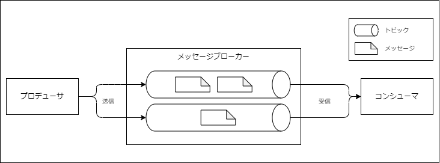

# 第4章：エンコーディングと進化
### 本章の概要
* データのエンコーディングのフォーマット
    * 本章では、JSONやXML、Protocol Buffersなどのデータをエンコードするフォーマットとそれぞれのスキーマの変更をどのように扱うか説明する
* データフローの形態
    * また、これらのフォーマットがデータストレージとネットワーク上の通信において、どのように使われるのか述べる

### アプリケーションの進化性
* 追加的なユーザー要求やビジネス環境の変化に伴い、機能追加や変更が発生する
* アプリケーションの変更に伴い、保存するデータも変更される可能性がある
    * レコードの種類の追加
    * 新しいフィールドの追加
* データフォーマットやスキーマが変わるとアプリケーション側も対応する必要がある
* しかし、大規模なアプリケーションでは即座に変更できず、新旧バージョンのコードと新旧バージョンのデータフォーマットが混在する可能性がある
    * サーバーサイドではローリングアップグレードで段階的にリリースされる
    * クライアントサイドではユーザーがアップデータを実行しない場合がある

### データの互換性
* 以上のように新旧バージョンのコードとデータが混在する環境では、前方後方どちらに対しても互換性を管理する必要がある
    * 後方互換性
        * 古いコードで書かれたデータを新しいコードが読める
    * 前方互換性
        * 新しいコードで書かれたデータを古いコードが読める


> [!NOTE]
> 
> :memo:コメント
> 

## データエンコードのフォーマット
### プログラムが扱うデータのフォーマット
1. メモリ内のデータ
    * CPUによるアクセスや操作のために最適化されたデータ構造で保持
        * オブジェクト
        * 構造体
        * リスト
        * 配列
        * ハッシュテーブル
        * ツリー
    * ポインタを使用する
2. ディスク、ネットワーク上のデータ
    * ファイル書き込みやネットワーク転送の場合、データをバイトの並び（JSONドキュメントなど）としてエンコードする
    * ポインタはメモリを共有しない他のプロセスでは意味をなさないので、メモリ内のデータ構造とは大きく異なる

* 1、2のフォーマットの間で変換が必要になる
    * エンコーディング
        * 1 → 2の変換
        * インメモリの表現からバイトの並びに変換する
        * 別名
            * シリアライゼーション
                * 異なる文脈で異なる意味で使われるので注意
            * マーシャリング
    * デコーディング
        * 2 → 1の変換
        * バイトの並びからインメモリの表現に変換する
        * 別名
            * パース
            * デシリアライゼーション
            * アンマーシャリング

### 言語固有のフォーマット
* プログラミング言語におけるバイトへエンコードする機能がある
    * 例）
        * Java
            * Java.io.Serializable
            * Kryo
        * Ruby
            * Marshal
        * Python
            *   pickle
* 最小限のコードでインメモリのデータの保存とリストアができる
* 問題
    * 特定のプログラミング言語と密接に関係するため、他言語でデータを読むことが難しくなる
        * その言語に長い間ロックインされてしまう
        * 他言語を用いる他組織との結合も困難
    * セキュリティの問題
        * デコーディング時に任意のクラスをインスタンス化させる必要があり、攻撃者に任意のコードをリモート実行されるリスクがある
    * バージョニング
        * 多くの場合、データのバージョニングが後付けになり、前方/後方互換性が問題になりやすい
    * 効率性が低い
        * エンコードやデコードにかかるCPU時間やエンコード後のデータサイズが後付けで考えられるため、パフォーマンスが悪くサイズ効率も悪い

### テキストエンコーディング
#### JSON、XML、CSV
* 人間が読みやすいフォーマット
* 問題
    * データ型
        * 数値と数字が区別がない（XML、CSV）
        * 整数値と浮動小数点数を区別しない（JSON）
            * 大きな数値を扱う時に問題になる
        * バイナリ文字列をサポートしていない
            * 回避策としてBase64でエンコードする方法が使われるが、データサイズは増加する
    * スキーマ
        * JSON/XML：スキーマは存在するが、スキーマを使わないアプリケーションはエンコーディング/デコーディングのロジックをハードコードする
            * XML、JSONともにスキーマ自体はある
                * [XML Schema](https://www.w3schools.com/xml/schema_intro.asp)
                * [JSON Schema](https://json-schema.org/learn/getting-started-step-by-step)
        * CSV：スキーマがないため、列や行の意味はアプリ側で解釈する
* 問題はあるが多くの場合目的を十分に満たすため、エンコード、デコードの方式で複数の組織/関係者間で合意できていれば良い

### バイナリエンコーディング
* JSONはバイナリフォーマットと比較すると容量が大きい
* バイナリにエンコードすることでデータ容量を小さくできる
    * 小さいデータセットではあまり違いは見られないが、データセットが大きくなれば影響も大きくなる

#### XML/JSONのバイナリエンコーディング
* JSON/XML用のバイナリエンコーディングがある
    * XML
        * WBXML
        * Fast Infoset
    * JSON
        * MessagePack
        * BSON
        * BJSON
        * UBJSON
        * BISON
        * Smile
* JSON、XMLではスキーマを持たないから、エンコードされたデータにすべてのオブジェクトのフィールドを含める必要がある
    * →バイナリエンコードしてもデータ容量はあまり減らず、あえて人間の読めないフォーマットであるバイナリにする意味があまりない

#### ThriftとProtocol Buffers
ThriftとProtocol Buffersはともにスキーマを必要とするバイナリエンコーディングライブラリ
* Apache Thrift
    * https://thrift.apache.org/
    * ThriftのIDL（Interface Definition Language:インターフェース定義言語）でのスキーマ例
        * スキーマにフィールド名があるため、エンコードされたデータにはフィールド名と対応したフィールドタグ（1,2,3）だけ含めればよい
    ```
    struct Person {
        1: required string userName,
        2: optional i64 favoriteNumber,
        3: optional list<string> interests
    }
    ```
* Protocol Buffers
    * https://protobuf.dev/
    * Protocol Buffersでのスキーマ例
    ```
    message Person {
        required string user_name = 1;
        optional int64 favorite_number = 2;
        repeated string interests = 3;
    }
    ```

#### スキーマの進化
スキーマは時間の経過とともに変化する
##### フィールドタグの変更
* バイナリエンコードされたデータでは、フィールドはタグ番号で識別される
* スキーマの中のフィールド名を変更することはできるがタグは変更できない
* 新しいタグ番号を使うと新しいフィールドを追加できる
* 前方互換性
    * 新しいコードで書かれたデータを古いコードで読むときは、新しいフィールドは無視されるため前方互換性は保たれる
* 後方互換性
    * フィールドがユニークなタグを持っていればタグの意味が変わらないので、新コードは旧データで書かれたデータを読むことができる
    * しかし、新しく追加するフィールドは、旧コードで書いたデータを新コードで読めなくなるため、必須にできない

##### データ型の変更
* データ型を変更すると値の精度が低くなったり、切り捨てられてしまったりするリスクがある
    * 例
        * 32bit整数から64bit整数に変更する
        * パーサは足りないビットを0で埋めるため、新コードは旧コードで書かれたデータを読める
        * 新コードで書かれたデータを旧コードが読んだ場合、旧コードは32bit長として変更に格納するので切り詰められる

#### Avro
* バイナリのエンコーディングフォーマットで、ThriftがHadoopのユースケースにうまく適合しなかったことを受けて作られた
    * https://avro.apache.org/
* Avroもデータ構造の指定にスキーマを使用する
    * Avroで使用できるスキーマ言語
        * Avro IDL
            * 人間が編集することを意図したもの
        ```
        record Person {
            string userName;
            union {null, long} favoriteNumber =null;
            array<string> interests;
        }
        ```
        * JSONベース
            * 機械が読み取りやすいもの
        ```
        {
            "type": "record",
            "name": "Person",
            "fields": [
                {"name": "userName", "type": "string"},
                {"name": "favoriteNumber", "type": ["null", "long"], "default": null},
                {"name": "interests", "type": {"type": "array", "items": "string"}}
            ]
        }
        ```
* 特徴
    * タグ番号がない
    * データには連結された値だけが含まれる
    * パースするにはスキーマを使ってそれぞれのフィールドのデータ型を解釈する必要がある
    * 読み取るコードが書き込んだときと（互換性のある）同じスキーマを使わなければデコードできない
        * Avroにおいてはライターとリーダーのスキーマは同一である必要はなく、互換性さえあれば良い
            * ライターのスキーマ
                * データをエンコードするときに使用するスキーマ
                * Avroではデータをエンコードするとき、いかなるバージョンのスキーマも使用できる
            * リーダーのスキーマ
                * デコードするときに使用するスキーマ
        * ライブラリがライターのスキーマとリーダーのスキーマを並べて調べることで解決
            * →ライターのスキーマをリーダーはどうやって知るのか？（→[ライターのスキーマを参照する方法](#####ライターのスキーマを参照する方法)）

##### スキーマの進化の規則
* 前方互換性
    * 以下を満たす
        * 新スキーマ：ライター
        * 旧スキーマ：リーダー
* 後方互換性
    * 以下を満たす
        * 新スキーマ：リーダー
        * 旧スキーマ：ライター
* 互換性を保つため、追加や削除ができるのはデフォルト値を持つフィールドのみ
    * デフォルト値なしで新フィールドを追加
        * 新スキーマをもつリーダーは旧スキーマのライターで書かれたデータを読めなくなる
    * デフォルト値を持たないフィールドを削除
        * 旧スキーマをもつリーダーは、新スキーマのライターで書かれたデータが読めなくなる
    * デフォルト値をnullにする場合は、スキーマにunion型で明示的に書く必要がある

##### ライターのスキーマを参照する方法
* 疑問：あるデータがエンコードされた際のライターのスキーマをリーダーはどのやって知るのか？
    * スキーマの方がデータよりはるかに大きくなるので、すべてのレコードに含めることはできない
* 答え：使用方法に依存
    * 大量のレコードを持つ大きなファイルの場合
        * ライターがファイルの先頭に一度だけライターのスキーマを含めておく
            * Avroではオブジェクトコンテナファイルというファイルフォーマットが定められている
            * 同じスキーマでエンコードされた何百万ものレコードが含まれているファイルの場合、各レコードにスキーマを入れるとデータ容量が大きくなってしまう
    * 個別にレコードが書かれるデータベースの場合
        * エンコードされたレコードの先頭にバージョン番号を含め、スキーマのバージョンのリストをDB上に保存して置き、都度フェッチしてそのスキーマを使用してデコードする
            * 異なるライターのスキーマを使って様々なレコードが書かれるためすべてのレコードが同じレコードとは見なせないため
            * 使用例：Espresso
            * ドキュメンテーションとしての役割も果たし、スキーマの互換性チェックができるため様々なユースケースで使える
    * ネットワーク経由でレコードを送信する場合
        * 2つのネットワークのプロセスが接続の確立時にスキーマのバージョンに関するネゴシエーションを行う（接続されている間、スキーマを使える）

#### 動的に生成されたスキーマ
* Avroの利点
    * タグ番号を含まないため、動的に生成されたスキーマと相性がいい
        * DBのスキーマをエンコードして内容をAvroのオブジェクトコンテナファイルにダンプできる
            * それぞれのテーブルのレコードのスキーマを生成して、テーブルの列をAvroのフィールドにマッピングできる
            * DBのスキーマが変更された（列の追加、列の削除など）とき、更新されたDBのスキーマから新しいAvroスキーマを生成してそのスキーマでデータをエクスポートできる
    * ThriftやProtocol Buffersで同じことを使用とした場合は、フィールドタグの割り当ては手作業で行う必要がある
        * 自動化できても割り当てに不備がないか細心の注意を払う必要がある

#### コード生成と動的型付け言語
* コード生成
    * スキーマを定義すれば、実装コードを任意の言語で生成できる
    * 静的型付け言語の場合
        * 型チェックやIDEの自動補完機能を利用できるため有益
    * 動的型付け言語の場合
        * 型チェックしないため、コード生成はあまり価値はない
        * 動的に生成されたスキーマ（DBのテーブルから生成されたAvroスキーマ）の場合、コード生成はデータへのアクセスに対する不必要な障害になる
* Avroはコード生成もできるが、コード生成なしでも活用できる
    * オブジェクトコンテナファイルがあればそのファイルを開いてJSONファイルを見るのと同様にデータを読むことができる
        * オブジェクトコンテナファイル
            * ライターのスキーマが埋め込まれているファイル
            * ファイルに必要なメタデータが含まれるため自己記述型

### スキーマのメリット
* バイナリJSONよりもデータ容量が小さくなる
    * エンコードされたデータにフィールド名を含める必要がないから
* スキーマはドキュメンテーションとして価値があり、デコード時にスキーマが必要になるため常に最新の状態であることを保証できる
    * 手作業のドキュメントメンテナンスは実装と乖離しやすい
* スキーマのデータベースを管理することで、スキーマの変更の前方/後方互換性をチェックできる
* 静的型付け言語向けに、コンパイル時の型チェックができるためスキーマからのコード生成は便利


> [!NOTE]
> 
> :memo:4.1節のコメント
> > 同じオブジェクト型でデータをリストアしようとするなら、デコーディングのプロセスは任意のクラスをインスタンス化できなければなりません。これはセキュリティ上の問題の発生源になることが頻繁にあります(p122)
> 
> エンコード・デコードの話とは直接関係ないけど、データから任意のクラスをインスタンス化させる脆弱性で似たようなものでLog4jの脆弱性の話を思い出した(RyoyaC)
> - [参考:公式の翻訳](https://qiita.com/Amplil/items/7e27631cd8620fcbf2f3#%E9%87%8D%E8%A6%81%E3%82%BB%E3%82%AD%E3%83%A5%E3%83%AA%E3%83%86%E3%82%A3%E8%84%86%E5%BC%B1%E6%80%A7-cve-2021-44832)
>
> ---
>
> > それが何であれ、何かについて複数の組織が合意するということは、他のほとんどの懸念事項よりも難しいこと
>
> ExcelやPowerPoint、なぜか多用されるCSVによる連携はこれが一番大きい気がする。
> 何でも良いから共通で使える形式であることが望まれる。（Katsuya）
>
> ---
> - JSONスキーマが使われているところはたしかにあまり見ないかも。静的型付け言語ではスキーマを使用せず型とマッピングする方式がよくつかわれてる印象。（JavaのJacksonなど）(RyoyaC)
>   - このように型とスキーマのマッピングを行っている場合、スキーマが変わる（項目の増減、データ型の変更）とマッピング時にエラーになる（詳しく検証したわけではないが）ので、スキーマの変更はクライアント・サーバで同期的に行わなければならないから、複数の組織が使用するWebAPIなどでJSONを返すときはバージョニングを考慮する必要がある。
>   - JSONの型マッピングを扱っている場合でもスキーマの進化性をある程度許容（余計な項目が追加されても無視する、など）する方法はあるか？
>   - それとも他組織/チームのAPIを利用する場合はそうした型のマッピングは適していないか？
>
> > 特にJSONやXMLはスキーマを持たないことから、エンコードされたデータに...
> 
> JSON、XMLはそれぞれスキーマ自体はあるが、データとしてエンコード・デコードするときにそれは必須ではなく、スキーマがなくても読める・書けるようにエンコーディング・デコーディングされているから、「スキーマを持たない」と表現していると解釈。(RyoyaC)
>
> ---
>
> - なんでProtocol Buffersにlistがなくてrepeatedなのか初めて理解できた。シーケンシャル値を取ってくうえで都合が良いのか。（Katsuya）
>

## データフローの形態
* 前節までの内容
    * ネットワーク経由でデータを送信したり、ファイルへデータを書きだす場合、バイト列にエンコードする必要があり、前節ではそのための様々なエンコーディングについて論じた
    * 前方/後方互換性は進化性にとって重要
        * 互換性はエンコードするプロセスとデコードするプロセスの関係性の問題
* データを別プロセスに流す方法は数多く存在するが、本節では一般的な方法をみていく
    * データベース経由のデータフロー
    * サービス呼び出し経由のデータフロー
    * 非同期メッセージパッシング経由のデータフロー

### データベース経由でのデータフロー
* DBでは後方互換性だけでなく、前方互換性が求められる場面も多い
* 後方互換性が必要なケース
    * DBでは書き込みを行うプロセスがデータをエンコードし、読み取りを行うプロセスがデコードする
        * DBにアクセスするプロセスは１つしか存在しないこともあるが、ライターとリーダーが同じプロセスで処理されているだけ
        * DBへの保存処理は将来の自分自身へのメッセージの送信と考えられる
    * 後方互換性がなければ、将来自分自身が書いたデータをデコードできなくなるため、明らかに求められる
* 前方互換性が必要なケース
    * データベースには複数のプロセスが同時にアクセスする
        * 異なるアプリケーション
        * 同じサービスの複数インスタンス
            * ローリングアップグレードで異なるバージョンのコードが混在しDBにアクセスする
    * 新しいバージョンによって書かれたデータベース中の値が動作し続けている旧バージョンのコードによって後から読まれるかもしれない
#### 互換性のための懸念点
* アプリケーションレベルでの配慮が必要な場合がある
    * 例
        * レコードのスキーマにフィールドを追加し、新バージョンのコードが新フィールドの値をDBに書き込む
        * 旧バージョンコードでそのレコードを読み、更新後に書き戻すとする
    * 望ましい動作
        * 新しいフィールドを解釈できなくても、旧コードが新フィールドには手を加えないこと
    * リスク
        * DBレコードをオブジェクトにデコードし、後にそのオブジェクトをレコードとしてエンコードし直すと、旧コードでは未知のフィールドは失われる可能性がある

#### 異なる値が異なる時刻に書き込まれるケース
* DBでは任意の値が任意のタイミングで更新できるため、5ミリ秒前に書かれた値と5年前に書かれた値が共存することがある
* アプリは旧バージョンを新バージョンのコードに置き換えることは容易だが、DBは明示的に書き直さない限り元のエンコーディングのまま残る
    * 「データはコードよりも長生きする」
* スキーマの変更（マイグレーション）はできるが、大規模なデータセットの場合は負荷が高いためできるだけ避ける
    * デフォルト値をnullで新しい列を追加するのは、旧データを書き変えずに実行できるRDBMSが多い
* スキーマの進化によってDBの下位のストレージには過去の様々なバージョンのスキーマでエンコードされた値が含まれていてもDB全体が単一のスキーマでエンコードされているかのように扱うことができる

#### アーカイブストレージ
* DBではスナップショットをとることがある
* DBに様々な時期にエンコードされたスキーマが混在していてもデータダンプは最新のスキーマでエンコードされるのが普通
    * このときに一貫性を保ってエンコードする
* データダンプは一度に書き出され、その後変更されることがないのでAvroのオブジェクトコンテナファイルのようなフォーマットが適する
* あるいは、Parquetのような分析に適した列指向フォーマットも適する

### サービス経由でのデータフロー

#### クライアント・サーバー
* ネットワーク経由での通信の方法はいくつかあるが、一般的なやり方はクライアントとサーバーで役割を設けること
* サーバーはネットワークに対してAPIを公開し、クライアントはサーバーに接続してそのAPIにリクエストを発行する
* サーバーが公開するAPIはサービスと呼ばれる

#### Webの動作
* クライアントがWebサーバーにリクエストを発行する
    * GETリクエストによってHTML、CSS、JavaScript、画像などをダウンロードする
    * POSTリクエストでサーバーにデータを投入する
* APIは標準化されたプロトコルとデータフォーマットで構成される
    * HTTP、URL、SSL/TLS、HTML

#### クライアントの種類
* Webブラウザ
* モバイルデバイス
* デスクトップコンピュータ
* 他サービス
    * サービスはデータベースに対してはクライアントとして振る舞う
    * アプリケーションの規模が大きくなると、機能領域ごとにサービスを分割するサービス指向アーキテクチャ/マイクロサービスアーキテクチャで構成されることがある

#### データベースとサービスの類似性
* クライアントからのデータ投入とクエリを受け付ける
    * DBは任意のクエリが使える
    * サービスはアプリケーション固有のAPIだけが公開され、許される入出力はビジネスロジックで定義されたものだけ
        * この制約でカプセル化できるようになる

#### サービス指向/マイクロサービスの設計目標
* それぞれのサービスで独立してデプロイし、進化させられるようにすることで、アプリケーションの変更とメンテナンスを容易にすること
    * それぞれのサービスは1つのチームが所有するべきであり、そのチームは新しいバージョンのサービスを他のチームとの調整なしにリリースできるようになるべき
    * 新旧バージョンのサービスが混在して動作することが予想されることから、APIのバージョンの互換性を保つ必要がある

#### Webサービス
* Webサービス
    * ユーザーのデバイス上で動作しているクライアントアプリケーションがHTTP経由でサービスにリクエストするケース
    * 同一組織内であるサービスが他のサービスにリクエストするケース
        * マイクロサービスが別のマイクロサービスにリクエストする
    * 他の組織が所有するサービスにリクエストするケース
        * クレジットカード処理システムやOAuthのAPIなど

#### 2つのアプローチ：RESTとSOAP
* REST
    * RESTはプロトコルではなく、HTTPの原理の上に構築された設計哲学
        * リソースの識別にURLを使うシンプルなデータフォーマット
        * キャッシュの制御
        * 認証
        * コンテントタイプ
    * RESTの原理に基づいて設計されたAPIをRESTfulと呼ぶ
    * シンプルなアプローチが好まれる傾向があり、コード生成や自動化されたツールの必要性が低い
    * OpenAPIのようなAPI定義フォーマットを使ってドキュメンテーションを生成することもできる
* SOAP
    * ネットワークAPIのリクエストを発行するためのXMLベースのプロトコル
        * HTTP経由で使われるのが一般的だが、HTTPから独立を保ち、HTTPの機能をほぼ使わないことを目標としている
        * その代わり様々な機能を追加する複雑な関連標準（web service framework WS-*と呼ばれる）がある
    * SOAPのAPIはWSDLと呼ばれるXMLベースの言語で記述される
        * WSDLを使うことでコード生成が可能になり、クライアントはローカルクラスのメソッド呼び出しを使ってリモートサービスにアクセスできる
        * 静的型付け言語では有益だが、動的型付け言語では役に立たない
        * WSDLは人間が読めるようには設計されておらず、SOAPメッセージは手作業で構築するには複雑すぎるため、ツールのサポート、コード生成、IDEに強く依存する

#### リモートプロシージャコール（RPC）の問題
* リモートプロシージャコール
    * RPCモデルはリモートにあるネットワークサービスへのリクエスト発行を同一プロセス内でのプログラミング言語における関数やメソッド呼び出しと同じように見せようとする
    * RPCは一見便利なように見えるが、RPCとローカル関数呼び出しは根本的に異なり、大きな問題があるため、同じものに見せようとしすぎるのは意味をなさない
* RPCの問題
    * ローカルの関数呼び出しは予測が可能だが、RPCリクエストでは予測ができない
        * リクエスト/レスポンスがネットワーク問題で消失
        * リモートサービスが利用不可能
        * これらの問題は利用者が制御できず、リクエストが失敗したらリトライする必要がある
    * RPCリクエストはタイムアウトする可能性がある
        * タイムアウトすると何が起きたのかはわからない
        * 結果を受け取れないと、リクエストが到達していたかどうかもわからない
        * ローカルの関数呼び出しは、結果を返す、例外を投げる、制御を返してこない（無限ループなど）の3通り
    * プロトコルに重複排除の仕組み（冪等性、idempotence）を構築しなければ、リトライで複数回実行される
        * ローカルではこの問題は起きない
    * RPCリクエストはローカル関数呼び出しよりはるかに低速で、レイテンシの変動幅も大きい
        * ネットワークの輻輳やサービス過負荷などによってレイテンシが変動する
    * RPCリクエストはパラメータはバイト列にエンコードして送る必要がある
        * ローカル関数呼び出しではメモリ内のオブジェクトへの参照を渡すことができるので効率的
        * プリミティブ型であれば問題にならないが、オブジェクトが大きくなると問題になる
    * クライアントとサーバーの実装言語は異なる可能性があるため、他の言語へデータ型を変換する必要がある
        * JavaScriptは整数と浮動小数点数を区別しない


#### 現在のRPCの方向性
* RPCはなくなっていない
    * gRPC
        * Protocol Buffersを使用したRPC
    * Finagle
        * Thriftを使用したRPC
    * Rest.li
        * HTTP、JSONを使用したRPC
* リモートのリクエストがローカルの関数呼び出しと異なることを明確にする
    * FinagleやRest.liはfuture(promise)を使って失敗するかもしれない非同期の動作をカプセル化する
    * gRPCはストリームをサポートして、単一のリクエストやレスポンスだけでなく、時間軸羽状のリクエストとレスポンスの列から構成されるものも一回の呼び出しで扱える
* サービスディスカバリ
    * フレームワークの中でサービスディスカバリを提供するものもある
    * クライアントが特定サービスを見つけるためのIPアドレスとポートを知ることができる
* 公開APIとしてはRESTが支配的
    * バイナリエンコーディングフォーマットのRPCはREST上のJSONよりも優れたパフォーマンスを発揮する
    * しかし、REST APIはパフォーマンス以外の大きな利点がある
    * REST APIの利点
        * 実験とデバッグに適している
            * Webブラウザやcurlコマンドがあればリクエストを発行できる
        * 主要なプログラミング言語やプラットフォームのすべてがサポートしている
        * 巨大なエコシステムがある
            * サーバー
            * キャッシュ
            * ロードバランサ
            * プロキシ
            * ファイアウォール
            * モニタリング
            * デバッグツール
            * テストツール

#### RPCのデータエンコーディングと進化
* クライアントとサーバーに変化を加えることができ、それぞれ独立してデプロイできることが重要
    * サーバーがまずアップデートされ、クライアントはその後にアップデートされると仮定できる
    * リクエストの後方互換性とレスポンスの前方互換性を保つ必要がある
        * 旧バージョンのクライアントでエンコードされたリクエストを、新バージョンのサーバがデコードできる
        * 新バージョンのサーバでエンコードされたレスポンスを旧バージョンのクライアントでデコードできる
* RPCスキームにおける前方/後方互換性の特性はRPCが使うエンコーディングから引き継がれる
* サービスの互換性が難しくなる理由は、RPCが使われるからサービスのプロバイダがクライアントを制御できず、アップグレードを強制できないから
    * 互換性は長期間保つ必要があり、その期限を切ることもできない
    * 互換性が保たれないような変更が必要になった場合、サービスプロバイダは複数バージョンのサービスAPIを平行してメンテナンスする必要がある
* APIのバージョン管理
    * APIのバージョン管理の方法は合意がなされていない
    * REST APIの場合はURLかHTTP Acceptヘッダー内でバージョン番号を使うのが一般的
    * クライアントの識別にAPIキーを使う場合、クライアントが要求したAPIのバージョンをサーバーに保管して置き、独立した管理用のインターフェースを通じて選択されたバージョンを更新できるようにしておくこともできる

### 非同期メッセージングパッシングによるデータフロー
#### 非同期メッセージングパッシング
* RPCとデータベースの中間
    * クライアントのリクエストが他のプロセスに送信される
        * RPCと類似
    * メッセージが直接ネットワーク接続を通じて送信されるわけではなく、一時的にメッセージを保存するメッセージブローカーと呼ばれる中継地点（メッセージキュー、あるいはメッセージ試行ミドルウェアとも呼ぶ）を経由する
        * データベースと類似（データベースの場合はメモリやディスク）

#### 直接のRPCと比較した利点
* システムの信頼性の向上
    * メッセージブローカーがバッファとして働き、システムの信頼性が向上する
        * 受信側が動作していないケースでもメッセージが失われない
            * メンテナンス中
            * 過負荷でリクエストを受け取れない
            * 一時的なネットワーク瞬断
    * メッセージブローカーは受信側のプロセスがクラッシュした場合にメッセージを再配信することでメッセージが失われることを防ぐ
* ネットワーク経路の論理的な分離
    * メッセージブローカーを使うことで、送信側は受信側のIPアドレスやポート番号を知る必要がなくなる
        * メッセージブローカーによって送信側と受信側が論理的に分離される

#### RPCとの違い
* メッセージパッシングによるコミュニケーションは単方向になる
    * 送信側はメッセージに対するリプライを受信しないものと考える
    * プロセスはレスポンスを送信することもできるが、別のチャネルで行われる
    * 送信側はメッセージが配信されるのを待たず、送信したらそのメッセージは忘れてしまう

#### メッセージブローカー
##### メッセージブローカーの製品
* エンタープライズ製品
    * TIBCO
    * IBM WebSphere
    * webMethods
* OSS
    * RabbitMQ
    * ActiveMQ
    * HornetQ
    * NATS
    * Apache Kafka

##### メッセージパッシングの構成要素(整理)
* メッセージ
    * 送信されるデータ
* メッセージブローカー（ブローカー）
    * メッセージを一時的に保存する中継地点
* トピック（キュー）
    * 特定のメッセージをいれておく場所
* コンシューマ（サブスクライバ）
    * メッセージを受け取る側
* プロデューサ（パブリッシャ）
    * メッセージを送る側

##### メッセージブローカーの仕組みの概要
)
* メッセージの送信
    * プロデューサが名前付きのトピックに対してメッセージを送信する
* メッセージの保存
    * ブローカーはトピックの1つ以上のコンシューマに対して、プロデューサからメッセージが届いたことを保証する
        * 1つのトピックには多くのプロデューサやコンシューマが関わる
        * トピックは一方通行のデータフローを提供する
* メッセージの取得
    * コンシューマがメッセージブローカーからメッセージを取り出してメッセージを読み込む

##### メッセージブローカーにおけるデータモデル
* メッセージブローカーは特定のデータモデルの利用を強制しない
    * メッセージは多少のメタデータを持つバイト列にすぎないので、任意のエンコーディングフォーマットが利用できる
    * エンコーディングが前方/後方互換性を持つなら、高い柔軟性をもってプロデューサとコンシューマを任意の順序えそれぞれ独立に変更してデプロイできる
* コンシューマがメッセージを他のトピックへ再発行する場合は、先にデータベースの場合について述べたような問題([互換性のための懸念点](####互換性のための懸念点))が生じないよう、未知のフィールドの保全に注意を払う必要がある

#### 分散アクターフレームワーク
##### アクターモデル
* アクターモデル
    * **単一プロセス内**での並行処理プログラミングモデルのこと
    * スレッド（およびスレッドにまつわるレース条件、ロック、デッドロックの問題）を直接扱わず、ロジックをアクターにカプセル化する
* アクター
    * 1つのクライアント、もしくはエンティティ
    * 非同期なメッセージの送受信で別のアクターと通信する
        * メッセージが配信されることは保証しない
        * ある種のエラー状況下ではメッセージは失われる
    * アクターはある時点では1つのメッセージしか処理しないため、スレッドに関する考慮は不要

##### 分散アクターフレームワーク
* 単一プロセスのアクターモデルを、複数ノードにスケールさせるために応用されたフレームワーク
    * アクターモデルとメッセージブローカーを統合したもの
    * メッセージパッシングの仕組みはアクターモデルと同じ
* 異なるノードにある場合は、メッセージ透過的にバイト列にエンコードされ、ネットワーク経由で送信された後、他方でデコードされる

##### アクターモデルのRPCと比較した際のメリット
* RPCよりも場所の透過性がうまく働く
    * 場所の透過性
        * リモートサービスによるメッセージ送信を、単一プロセス内でのプログラミング言語におけるメソッド呼び出しと同じように見せること
    * 理由
        * アクターモデルではメッセージが単一プロセス内でさえ失われることを前提にしているため
        * 同一プロセス内の場合と比較してネットワーク経由の場合はレイテンシが大きくなるが、コミュニケーションのミスマッチは少なくなる
            * メッセージ送信側がリトライなどを考慮する必要はない

##### 分散アクターフレームワークにおけるメッセージのエンコーディングの扱い
* アクターモデルのアプリケーションのローリングアップグレードを行う場合は、前方/後方互換性の考慮は必要
    * 新バージョンのノードから旧バージョンのノードへメッセージが送信されることがある
        * 逆もあり
* 3つの分散アクターフレームワークのエンコーディングの扱い
    * Akka
        * デフォルトでJavaに組み込まれたシリアライゼーションを利用
            * 前方/後方互換性はないためローリングアップグレードは負荷
        * シリアライゼーションをProtocol Buffersなどで置き換えることができ、その場合はローリングアップグレードも可能
    * Orleans
        * カスタムのデータエンコーディングフォーマットを使用するがローリングアップグレードはサポートしていない
        * 新バージョンのデプロイにはブルーグリーンデプロイを行う必要がある
            * 新クラスタを立ち上げて、トラフィックを旧クラスタから新クラスタに移した後、旧クラスタをシャットダウンする
    * Erlang OTP
        * レコードのスキーマに変更を加えるのは困難
        * ローリングアップグレードは可能だが、注意深く計画する必要がある
        * ※JSONに似た構造の実験的な新データ型mapsの導入で将来はローリングアップグレードが容易になる可能性がある


> [!NOTE]
> 
> :memo:4.2節のコメント
>
> > あるいは、Parquetのような分析に適した列指向フォーマット...
>
> Pythonで分析するとき、データをParquetで保存することがあって、内容よくわからず使ってたけど、列指向フォーマットだったから機械学習の文脈でよくでてきてたのか(RyoyaC)


## まとめ
* データ構造をディスク・ネットワーク上のバイト列に変換する方法をみてきた
    * エンコーディングは効率性に影響するだけでなく、アプリケーションアーキテクチャやデプロイ方法にも影響する
    * アプリケーションではローリングアップグレードなどをサポートする必要があり、そのために進化性が必要
    * ローリングアップグレードで異なるバージョンのコードが混在して動作する可能性があり、その場合にデータの互換性が保たれる方法でエンコードする必要がある
* エンコーディングフォーマット
    * プログラミング言語固有のエンコーディング
        * 1つの言語に限定され、前方/後方互換性がサポートされないケースが多い
    * テキストフォーマット
        * JSON、XML、CSVなど
        * 互換性は利用方法に依存する
        * データ型には曖昧さがあるので数値やバイナリ文字列では注意が必要
    * バイナリフォーマット
        * Thrift、Protocol Buffers、Avroなど
        * コンパクトで効率的なエンコーディングができる
        * 前方/後方互換性のセマンティクスが明確に定義されていて、スキーマはドキュメンテーションと静的型付け言語におけるコード生成に役立つ
        * デコードしなければ人間がデータを読めない
* データフローの形態
    * データベース経由
        * データを書き込みを行うプロセスがエンコード
        * データを読み込みを行うプロセスがデコード
    * RPC経由
        * クライアントがリクエストをエンコード
        * 次に、サーバがリクエストをデコードしてレスポンスをエンコード
        * 最後に、クライアントがレスポンスをデコード
    * 非同期メッセージパッシング
        * 非同期でメッセージを送信し、送信側がエンコード、受信側がデコードする

> [!NOTE]
> 
> :memo:コメント
> 